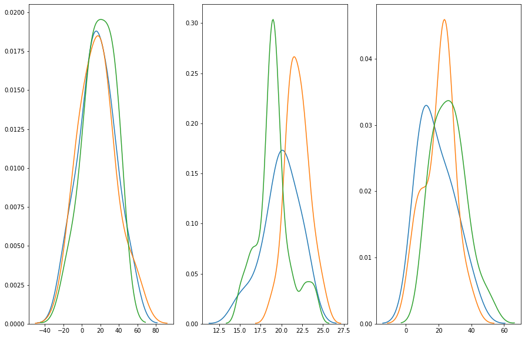

# ANOVA - Analysis of Variance
Today, we will be learning ANOVA, a generalized form of comparing mean across multiple groups. 
Agenda today:
1. Compare t-tests and ANOVA
2. Differentiate between variance between groups and variance within groups
3. Learn to calculate ANOVA
4. Implement ANOVA in Python
    - using statsmodels


## 1. T tests or ANOVA?
**ANOVA** or *Analysis Of Variance*  provides a statistical test of whether two or more population means are equal, and therefore generalizes the t-test beyond two means.

Suppose we want to compare whether multiple groups differ in some type of measures. For example, we have collected mood data grouped by four types of weather - sunny, raining, overcast, or cloudy, and we want to find out whether there is a difference in mood across different weather. What tests would you use?

A natural reaction would be to conduct multiple t-tests. However, that comes with many drawbacks. First, you would need $\frac{n(n-1)}{2}$ t tests, which come out to 6 tests. Having more tests meaning having higher chance of making type I error. In this case, our original probability of making type I error grew from 5% to 5% x 6 = 30%! By conducting 6 tests and comparing their mean to each other, we are running a huge risk of making false positives. This is known as the multiple comparison problem. How then, can we combat this? -- ANOVA!

Instead of looking at each individual difference, ANOVA examines the ratio of variance between groups, and variance within groups, to find out whether the ratio is big enough to be statistically significant. 

#### T Test statistics 
##### One sample
$t = \frac{x\bar - \mu}{\frac{s}{\sqrt n}}$

##### Two sample
$$ t = \frac{\bar{x_1} - \bar{x_2}}{\sqrt{s^2 \left( \frac{1}{n_1} + \frac{1}{n_2} \right)}}$$

where $s^2$ is the pooled sample variance,

$$ s^2 = \frac{\sum_{i=1}^{n_1} \left(x_i - \bar{x_1}\right)^2 + \sum_{j=1}^{n_2} \left(x_j - \bar{x_2}\right)^2 }{n_1 + n_2 - 2} $$

We can also say that t test is a special case of ANOVA in that we are comparing the means of only two groups.


#### ANOVA - the F test
$F = \frac{MS_{bet}}{MS_{within}}$

Just like t and z tests, we calculate a test statistic, then compare it to a critical value associated with a probability distribution.  In this case, that is the f-distribution.


Degrees of freedom of an F-test originate from:
  - the degrees of freedom from the numerator of the f-stat (DF between)
  - the degrees of freedom from the denominator of the f-stat (DF within) 
(more below)

# Discussion:

## Which test would you run for each these scenarios:

1. The average salary per month of an English Premier League player is $240,000€$. You would like to test whether players who don't have a dominant foot make more than the rest of the league.  There are only 25 players who are considered ambidextrous. 

2. You would like to test whether there is a difference in arrest rates across neighborhoods with different racial majorities.  You have point statistics of mean arrest rates associated with neighborhoods of majority white, black, hispanic, and asian populations.

3. You are interested in testing whether the superstition that black cats are bad luck affects adoption rate.  You would like to test whether black-fur shelter cats get adopted at a different rate than cats of other fur colors.

4. You are interested in whether car-accident rates in cities where marijuana is legal differs from the general rate of car accidents.  Assume you know the standard deviation of car accident rates across all U.S. cities.


```python

'''
# Which test would you run fort these scenarios:

1. The average salary per month of an English Premier League player is 240,000 Pounds. You would like to test whether players who don't have a dominant foot make more than the rest of the league.  There are only 25 players who are considered ambidextrous. 
Answer: one_sample t-test: small sample size  

2. You would like to test whether there is a difference in arrest rates across neighborhoods with different racial majorities.  You have point statistics of mean arrest rates associated with neighborhoods of majority white, black, hispanic, and asian populations.
Answer: ANOVA  
3. You are interested in testing whether the superstition that black cats are bad luck affects adoption rate.  You would like to test whether black-fur shelter cats get adopted at a different rate than cats of other fur colors.
Answer: Two-sample two tailed t-test  
4. You are interested in whether car-accident rates in cities where marijuana is legal differs from the general rate of car accidents. Assume you know the standard deviation of car accident rates across all U.S. cities.
Answer: Z-test  
'''
```


    "\n# Which test would you run fort these scenarios:\n\n1. The average salary per month of an English Premier League player is 240,000 Pounds. You would like to test whether players who don't have a dominant foot make more than the rest of the league.  There are only 25 players who are considered ambidextrous. \nAnswer: one_sample t-test: small sample size  \n\n2. You would like to test whether there is a difference in arrest rates across neighborhoods with different racial majorities.  You have point statistics of mean arrest rates associated with neighborhoods of majority white, black, hispanic, and asian populations.\nAnswer: ANOVA  \n3. You are interested in testing whether the superstition that black cats are bad luck affects adoption rate.  You would like to test whether black-fur shelter cats get adopted at a different rate than cats of other fur colors.\nAnswer: Two-sample two tailed t-test  \n4. You are interested in whether car-accident rates in cities where marijuana is legal differs from the general rate of car accidents. Assume you know the standard deviation of car accident rates across all U.S. cities.\nAnswer: Z-test  \n"


## 2. Differentiate between variance between groups and variance within groups


#### Between Group Variability

Measures how much the means of each group vary from the mean of the overall population


    

#### Within Group Variability

Refers to variations caused by differences within individual groups.  

Consider the given distributions of three samples below. As the spread (variability) of each sample is increased, their distributions overlap and they become part of a big population.


Now consider another distribution of the same three samples but with less variability. Although the means of samples are similar to the samples in the above image, they seem to belong to different populations.


## Trios: 
Take 2 minutes in groups of 3 to discuss which of these following trios would have high f-stats, and which would have low.

Plot them if, if that would help.

Run the f_oneway funciton scypy.stats to check your conclusions


```python
fig, ax = plt.subplots(1,3, figsize=(15,10))

sns.distplot(a, hist=False, ax=ax[0])
sns.distplot(b, hist=False, ax=ax[0])
sns.distplot(c, hist=False, ax=ax[0])

sns.distplot(one, hist=False, ax=ax[1])
sns.distplot(two, hist=False, ax=ax[1])
sns.distplot(three, hist=False, ax=ax[1])

sns.distplot(four, hist=False, ax=ax[2])
sns.distplot(five, hist=False, ax=ax[2])
sns.distplot(six, hist=False, ax=ax[2])

# Large variance overcomes the difference in means, so low fstat
print(stats.f_oneway(a,b,c))
# Difference in means is able to overcome the small variance, so high fstat
print(stats.f_oneway(one,two,three))
# Two samples are indistinguishable, but the third sample's large difference in means are able to overcome
# the within group variance to distinguish itself.
print(stats.f_oneway(four,five,six))
```

    F_onewayResult(statistic=0.06693195000987277, pvalue=0.9353322377145488)
    F_onewayResult(statistic=11.760064743099003, pvalue=5.2985391195830756e-05)
    F_onewayResult(statistic=3.194250788724835, pvalue=0.048432238619556506)





## 3. Calculating ANOVA 
In this section, we will learn how to calculate ANOVA without using any packages. All we need to calculate is:
 
$\bar{X} = $ Mean of Means = Mean of entire dataset


Total Sum of Squares is the square of every value minus the mean means, or in other words, the variance of the entire dataset without dividing through by degrees of freedom. 
- $SS_t$ = $\sum (X_{ij} - \bar X)^2$

The total sum of squares can be broken down into the sum of squares between and the sum of squares within.
- $SS_t =  SS_b+SS_w  $

The sum of squares between accounts for variance in the dataset that comes from the difference between the mean of each sample, without dividing through by the degrees of freedom.   
Or, in other words, the weighted deviation of each mean from the mean of means:
- $SS_b$ = $\sum(n_i(\bar X - \bar X_i)^2) $

The sum of squares within accounts for variance that comes from within each sample.  That is, the sum of the variance of each group weighted by its degrees of freedom. This is really just the sum of the square of each data point's deviation from its sample mean:
- $SS_w$ = $\sum (n_i - 1) s_i ^ 2$  

Degrees of Freedom for ANOVA:
-  $DF_{between}$ = k - 1
- $DF_{within}$ = N - k
- $DF_{total}$ = N - 1

Notations:
- k is the number of groups
- N is the total number of observations
- n is the number of observations in each group

- $MS_b$ = $\frac{SS_b}{DF_b}$
- $MS_w$ = $\frac{SS_w}{DF_w}$


- $F$ = $\frac{MS_b}{MS_w}$

Like regression and t-test, we can also perform hypothesis testing with ANOVA. 

- $H_0$ : $\mu{_1}$ = $\mu_2$ = $\mu_3$ = $\mu_4$
- $H_a$ : $H_0$ is not true

Under the null hypothesis (and with certain assumptions), both quantities estimate the variance of the random error, and thus the ratio should be small. If the ratio is large, then we have evidence against the null, and hence, we would reject the null hypothesis.

## Perform an ANOVA with scipy


```python
# PSEUDO CODE EXERCISE

1. # Calculate the mean of means.

X_bar = df.cnt.mean()

2. # define a variable (with an appropriate name) which contains the total variability of the dataset, 
# or in other words the total deviation from the mean

ss = sum([(x - X_bar)**2 for x in df.cnt])

3. # define a variable that contains the variability of the dataset which is results from the difference of means.
ssb = sum(
            [len(df[df.season_cat == season])*
             (X_bar 
             - np.mean(df[df.season_cat == season].cnt))**2 
             for season in df.season_cat.unique()
            ])
4. # define a variable that contains the variablity of the dataset which results from the variance of each sample
ssw = sum(
            [(len(df[df.season_cat == season])-1)
             * np.var(df[df.season_cat == season].cnt, ddof=1)
             for season in df.season_cat.unique()
            ])

5. # Sanity Check: make sure all of the variability of the dataset is accounted for by the two last answers.
print(round(ss, 3) == round((ssb + ssw), 3))

6. # Define variables that contain the values of the two important degrees of freedom.
df_b = 4-1
df_w = len(df) - 4


7. # Define a variable which holds a value which represents the variance of weighted individual group means.
msb = ssb/df_b
8. # Define a variable which holds a value which represents the variance of the weighted individual group variances.
msw = ssw/df_w
9. # Define and properly name a variable whose contents, if close to 1, represents a dataset whose 
# larger group variances drown the distinguishing qualities of differences in means.

f_stat = msb/msw

9 # Ensure that the prior calculation matches the output below:

f = stats.f_oneway(df['cnt'][df['season_cat'] == 'summer'],
                df['cnt'][df['season_cat'] == 'fall'], 
                df['cnt'][df['season_cat'] == 'winter'],
                df['cnt'][df['season_cat'] == 'spring'])

round(f.statistic, 3) == round(f_stat, 3)

```

    True


    True


## 4. Calculate ANOVA using statsmodel


## Next steps
Just because we have rejected the null hypothesis, it doesn't mean we have conclusively showed which group is significantly different from which - remember, the alternative hypothesis is "the null is not true". 

We need to conduct post hoc tests for multiple comparison to find out which groups are different, the most prominent post hoc tests are:
- LSD (Least significant difference)
    - $t\sqrt \frac{MSE}{n^2}$
- Tukey's HSD 
    - $q\sqrt \frac{MSE}{n}$
    
https://www.statisticshowto.com/studentized-range-distribution/#qtable
    
After calculating a value for LSD or HSD, we compare each pair wise mean difference with the LSD or HSD difference. If the pairwise mean difference exceeds the LSD/HSD, then they are significantly different.

## Two-Way ANOVA:

Returning to the example at the very beginning of the lesson, say 
we found out, using one-way ANOVA, that the season was impactful on the mood of different people. What if the season was to affect different groups of people differently?  Maybe older people were affected more by the seasons than younger people.

Moreover, how can we be sure as to which factor(s) is affecting the mood more? Maybe the age group is a more dominant factor responsible for a person's mood than the season.

For such cases, when the outcome or dependent variable is affected by two independent variables/factors we use a slightly modified technique called two-way ANOVA.

### Resources

https://www.analyticsvidhya.com/blog/2018/01/anova-analysis-of-variance/
    
https://support.minitab.com/en-us/minitab-express/1/help-and-how-to/modeling-statistics/anova/how-to/one-way-anova/before-you-start/overview/
